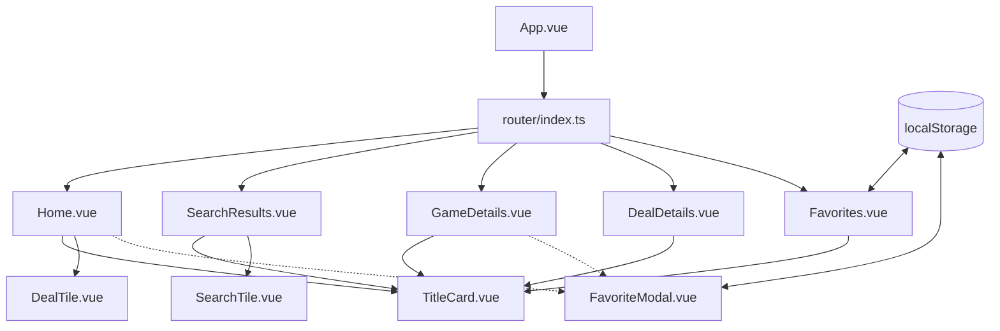

# GameDeals Finder

A modernized, responsive, and secure frontend Single Page Application (SPA) for finding cheap PC game deals, powered by the CheapShark API. 

This app has been rebuilt using **Vue 3**, **TypeScript**, and **Vite**, featuring a premium minimalist dark dashboard aesthetic with custom accessible components.

---

## 🛠️ Local Development Setup

To run the application locally in development mode:

### Prerequisites
- **Node.js** (v18+ or later)
- **Yarn** (v1.x) or **npm**

### Step 1: Install Dependencies
Navigate into the `app` folder and run the install script:
```bash
cd app
yarn install
```

### Step 2: Run Development Server
Start the dev server with hot-module reloading:
```bash
yarn dev
```
Open your browser and navigate to the address shown in the terminal (usually `http://localhost:5173`).

### Step 3: Compiling for Production
To check syntax linting and build optimized static assets:
```bash
yarn build
```
This generates production-ready assets inside the `app/dist/` directory.

### Step 4: Running Unit Tests
To run Vitest unit tests to verify component functionality and prevent regressions:
```bash
# Run tests in watch mode
yarn test

# Run tests once for CI verification
yarn test:run
```

---

## 🐳 Docker Build & Push

We deploy the application using a multi-stage Docker build served via Nginx.

### Automated Script
We provide a [run.sh](file:///Users/codyuhi/dev/repos/game-deals/run.sh) script in the root directory to automate building and pushing the image:
```bash
./run.sh
```
This script runs the following Docker commands:
1. **Builds** the image using the root [Dockerfile](file:///Users/codyuhi/dev/repos/game-deals/Dockerfile):
   ```bash
   docker build -t harbor.minipc.local/library/game-deals:latest .
   ```
2. **Pushes** the built image to the local Harbor registry:
   ```bash
   docker push harbor.minipc.local/library/game-deals:latest
   ```

### Dockerfile Design
The multi-stage [Dockerfile](file:///Users/codyuhi/dev/repos/game-deals/Dockerfile) ensures a secure and optimized build:
- **Build Stage:** Utilizes a lightweight Node.js environment (`node:20-alpine`) to install packages, perform TypeScript verification compiles, and bundle the static files using Vite.
- **Production Stage:** Copies the compiled HTML, CSS, and JS assets from the build environment into a high-performance, minimal Nginx server (`nginx:1.25.1-alpine`) running on port 80.

---

## 📐 Application Architecture & Design



### Type Definitions
All API models and local storage structures are defined in [types/index.ts](file:///Users/codyuhi/dev/repos/game-deals/app/src/types/index.ts). This ensures strict compilation checking for deals, stores, game queries, and favorites groups.

### Styling System
Global variables, layout configurations, and component animations are declared in [style.css](file:///Users/codyuhi/dev/repos/game-deals/app/src/style.css). It implements:
- **CSS Cascade Layers (`@layer reset, base, components, layouts`):** Avoids BEM selector clutter and prevents specificity ordering bugs.
- **Minimalist Dark Theme:** High-contrast slates, custom glassmorphism borders, glowing highlights, and soft responsive shadows.
- **Fluid Typography:** Uses CSS `clamp()` to scale sizes based on viewport widths.
- **Responsive Grids:** Implements container-friendly card lists.

---

## 🧩 Component Breakdown & Interactions

### Layout Shell
- **[App.vue](file:///Users/codyuhi/dev/repos/game-deals/app/src/App.vue):** The application root layout.
  - Contains the sticky header navigation bar, logo link, search query forms, and a footer linking to the source code.
  - Houses the `<router-view>` and applies transition animations (`fade`) during page routing.

### UI Components
- **[TitleCard.vue](file:///Users/codyuhi/dev/repos/game-deals/app/src/components/TitleCard.vue):** A dynamic hero-banner component.
  - Displays page titles, descriptions, and optional search controls.
  - Computes CSS radial-gradient mesh glows matching the theme context (e.g. Amber for Home, Emerald for Deals, Sky Blue for Games) avoiding the need for heavy visual image files.
- **[DealTile.vue](file:///Users/codyuhi/dev/repos/game-deals/app/src/components/DealTile.vue):** A grid-card displaying an individual deal.
  - Formats sale vs. retail pricing, deal score metrics, savings badges, and store logos.
  - **Click Separation:** Clicking the card image links to the deal details, the game title links to the game page, and the favorite button emits a `@favorite` event. This resolves the legacy code's nested `<a>` tag bugs.
- **[SearchTile.vue](file:///Users/codyuhi/dev/repos/game-deals/app/src/components/SearchTile.vue):** A horizontal tile rendering search outputs.
  - Showcases the game's thumbnail, cheapest active deal value, and links to game details and cheap-deal routing.
- **[FavoriteModal.vue](file:///Users/codyuhi/dev/repos/game-deals/app/src/components/FavoriteModal.vue):** An overlay modal utilizing the native HTML `<dialog>` element.
  - Exposes an `open()` function that can be triggered by parent views via a Vue template ref.
  - Fetches existing groups from `localStorage`, prompts group selection or new nickname input, and updates `localStorage.favorites`. Handles modal Esc-key closes and overlays out-of-box.

### View Pages (Routed)
- **[Home.vue](file:///Users/codyuhi/dev/repos/game-deals/app/src/views/Home.vue):** The landing dashboard.
  - Fetches list of stores and active deals. Displays them in a responsive CSS Grid.
  - Integrates [FavoriteModal.vue](file:///Users/codyuhi/dev/repos/game-deals/app/src/components/FavoriteModal.vue) and triggers it when a [DealTile.vue](file:///Users/codyuhi/dev/repos/game-deals/app/src/components/DealTile.vue) fires a `@favorite` event.
- **[SearchResults.vue](file:///Users/codyuhi/dev/repos/game-deals/app/src/views/SearchResults.vue):** Displays search queries.
  - Uses `useRoute` from `vue-router` to extract search terms type-safely.
  - Watches parameters to trigger fresh search queries when executing searches from other pages.
- **[GameDetails.vue](file:///Users/codyuhi/dev/repos/game-deals/app/src/views/GameDetails.vue):** Detailed game data.
  - Lists historical lowest deal dates and all current deals sorted by best price.
  - Allows saving the game using the custom favorites modal.
- **[DealDetails.vue](file:///Users/codyuhi/dev/repos/game-deals/app/src/views/DealDetails.vue):** Detailed deal analytics.
  - Analyzes metacritic ratings, steam scores, and pricing reviews.
  - Runs comparisons check against alternate stores and links to the merchant site.
- **[Favorites.vue](file:///Users/codyuhi/dev/repos/game-deals/app/src/views/Favorites.vue):** Custom favorites manager.
  - Group lists are loaded from `localStorage`.
  - **Inline Editing:** Clicking the edit icon toggles individual card headers to a text input, allowing users to rename groups without native alert boxes.
  - **Inline Deletion Confirmation:** Removing items or deleting groups prompts confirm choices directly inside the card layout context, avoiding distracting browser dialog boxes.
